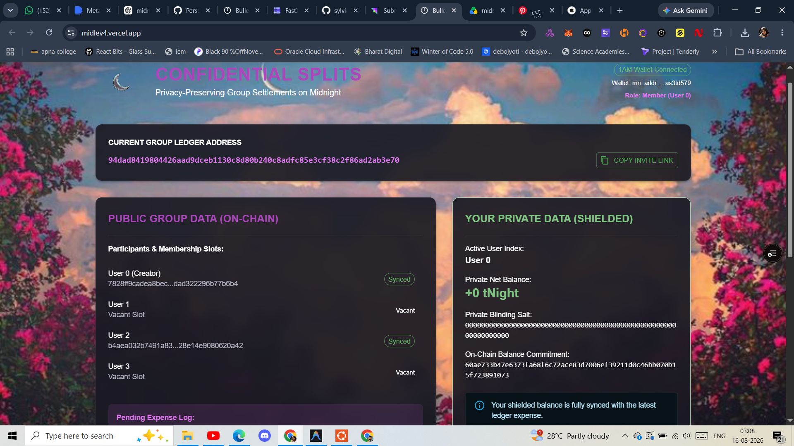
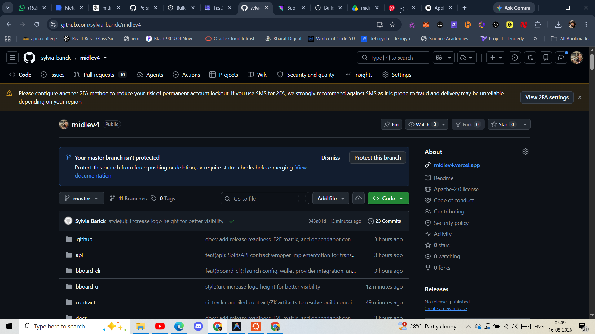
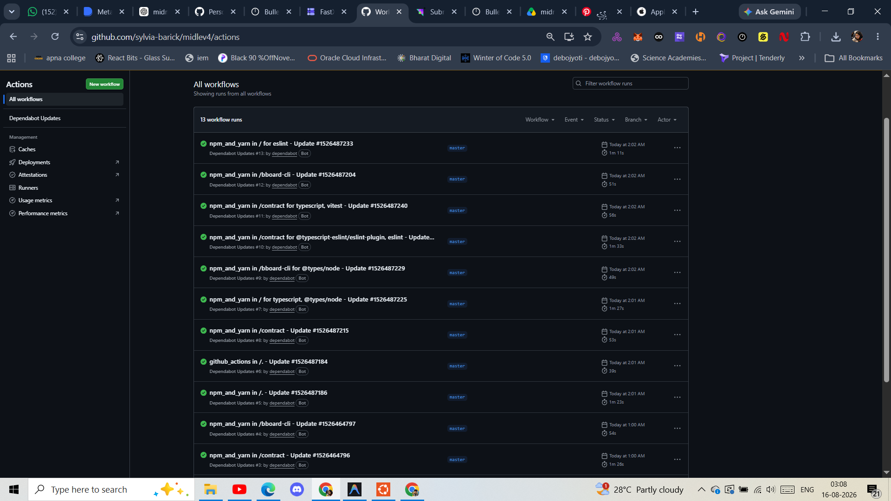

# Confidential Splits


[](https://shields.io/)
[](https://midnight.network/)



A privacy-preserving group expense tracker and settlement application built on the **Midnight Network**. Confidential Splits simplifies collective debts while keeping individual running balances, private witnesses, and blinding factors completely private on-chain using Zero-Knowledge proofs.

---

## 🚀 Level 4 - Waxing Gibbous Submission

* **Public GitHub Repository**: [https://github.com/sylvia-barick/midlev4](https://github.com/sylvia-barick/midlev4)
* **Live Preprod Demo**: [https://midlev4.vercel.app/](https://midlev4.vercel.app/)
* **Demo Video Folder**: [https://drive.google.com/drive/folders/1yGLrMIRjEJaOyin215wK-29l6Ppci6SN?usp=sharing](https://drive.google.com/drive/folders/1yGLrMIRjEJaOyin215wK-29l6Ppci6SN?usp=sharing)
* **Product X (Twitter) Profile**: [https://x.com/Sylviabarick](https://x.com/Sylviabarick)
* **Real Preprod E2E Evidence**: Verified template references located in [`docs/PREPROD_EVIDENCE.md`](file:///docs/PREPROD_EVIDENCE.md) and [`docs/FINAL_E2E_TEST.md`](file:///docs/FINAL_E2E_TEST.md).



---

## 💡 Why Midnight?

Traditional blockchains leak all transaction histories, balances, and financial graphs publicly. Midnight splits application states into:
1. **Public Ledger State**: Committed permanently on-chain.
2. **Private Client State**: Evaluated locally in browser sandboxes.

Confidential Splits utilizes Midnight's **Compact** smart contract language to write zero-knowledge circuits. The DApp executes local proofs using client-side witnesses, proving the correctness of transactions (such as posting an expense or claiming a settlement) without ever revealing user balances or salts on-chain.

---

## 🗺️ System Integration Flow

```
  [User Action] ──► [1AM Wallet] ──► [DApp Connector] ──► [ZK Proof Provider] 
                                                                  │
  [DApp State] ◄── [Indexer Stream] ◄── [Midnight Preprod] ◄──────┘
```

1. **User Action**: Guest connects to DApp via invite URL or creates a group.
2. **1AM Wallet**: Standard Chrome extension provides unshielded keys and signs payloads.
3. **DApp Connector**: Manages sessions and routes transaction data.
4. **ZK Proof Provider**: Generates cryptographic proofs using keys served locally at `/keys/*`.
5. **Compact Circuit**: Contract circuits check VM-level assertions client-side.
6. **Midnight Preprod**: Nodes verify proofs and update the public commitments ledger.
7. **Indexer Stream**: GraphQL pub/sub updates the UI state automatically.

---

## 🔒 Privacy Model Specification

| Data Field | Classification | Storage Location | Rationale / Boundary |
| :--- | :--- | :--- | :--- |
| **Running Balances** | **PRIVATE** | Client Memory / Local State | Net balances represent sensitive financial history and are kept client-side. |
| **Blinding Salts** | **PRIVATE** | Client Memory / Local State | Cryptographic random 32-byte salts prevent brute-force commitment tracking. |
| **ZK Witness Key** | **PRIVATE** | Client Memory / Local State | Private key witness ($sk$) derived from connected wallet unshielded addresses. |
| **Balance Commitments**| **PUBLIC** | On-Chain Ledger State | Double-blind Poseidon hashes $\text{Commitment} = \text{hash}(\text{Balance}, \text{Salt})$. |
| **Membership Slots** | **PUBLIC** | On-Chain Ledger State | ZK public keys stored in the dynamic \`members\` vector (unjoined slots are padded). |
| **Pending Metadata** | **PUBLIC** | On-Chain Ledger State | Pending expense shares, payer indices, and payment routing parameters are visible strictly during active sync/settle windows. |

---

## 🤝 Dynamic Membership & Invite Flow

* **Creator**: Wallet A connects to the DApp and deploys the contract. Slot 0 is assigned Wallet A's public key; Slots 1–3 are initialized as vacant (\`pad(32, "")\`).
* **Invite URL**: Creator copies and shares the invite link:
  `https://midlev4.vercel.app/?join=<contractAddress>`
  The invite link contains only the public contract address, leaking no private parameters.
* **Joining**: Guest opens the invite URL with Wallet B, connects to the DApp, and clicks **Join Slot** next to a vacant Slot index. The DApp executes the ZK `join_group` circuit, writing their ZK public key to the vacant ledger index.

---

## ⚡ Smart Contract Circuits

The contract implements five main ZK proof circuits:
1. **`join_group(idx)`**: Guest users claim a vacant slot and write their public key.
2. **`post_expense(payer_idx, amount, shares)`**: Validates that splits sum exactly to the total expense amount.
3. **`sync_balance(idx, old_balance, old_salt, new_salt)`**: Locally updates and synchronizes net private balance commitments.
4. **`post_payment(debtor, creditor, amount, old_balance, old_salt, new_salt)`**: Debtor posts a settlement, locking routing parameters and updating balance commitments.
5. **`claim_payment(old_balance, old_salt, new_salt)`**: Creditor pulls pending settlement funds on-chain, clearing status.

---

## 🧮 Settlement Algorithm

The **Settlement Optimizer** runs a local deterministic greedy cash flow simplification:
1. Reads synced private net balances from active group members.
2. Identifies the maximum debtor (most negative balance) and maximum creditor (most positive balance).
3. Resolves the settlement payment amount:
   $$\text{Amount} = \min(|B_{\text{debtor}}|, B_{\text{creditor}})$$
4. Registers the payment routing path and updates transient balances.
5. Repeats recursively until all balances converge to zero.
* **Note**: This is client-side cash flow optimization. Actual balance transitions require executing real on-chain `post_payment` and `claim_payment` circuits.

---

## 🛠️ Local Development & Quickstart

### Prerequisites
* Node.js `v24.11.1` (see [`.nvmrc`](file:///.nvmrc))
* Docker Desktop

### 1. Start Local Proof Server
The proof server generates ZK proofs and is required for transaction execution:
```bash
cd bboard-cli
docker compose -f proof-server-local.yml up -d
cd ..
```

### 2. Install Dependencies & Build
Install dependencies from root and build all workspaces in topological order:
```bash
npm install --legacy-peer-deps
npm run build
```

### 3. Compile Contracts
To re-compile Compact smart contracts:
```bash
npm run compact --workspace=contract
```

### 4. Run Automated Verification Tests
Run 27/27 Vitest contract simulation tests:
```bash
npm test --workspace=contract
```

---

## 📋 CI/CD Pipeline Configuration

This repository runs a continuous integration pipeline via GitHub Actions ([`.github/workflows/ci.yaml`](file:///.github/workflows/ci.yaml)) on every push and pull request to the `master` branch. The runner:
1. Installs the Compact Compiler (`setup-compact-action` version `0.31.1`).
2. Configures Node.js v24.
3. Installs dependencies and runs typechecks, lints, and builds across all workspaces.



---

## ⚠️ Known Constraints & Limitations
* **Maximum 4 participants**: Group size is capped at 4 members. Larger groups require reallocating static vectors and compiling new ZK prover/verifier key structures.
* **Sequential Sync**: State commitments are checked sequentially per participant to protect shielded balance transition invariants.
