# Confidential Splits

[](https://www.typescriptlang.org/)
[](https://midnight.network/)
[](./LICENSE)

<p align="center">
  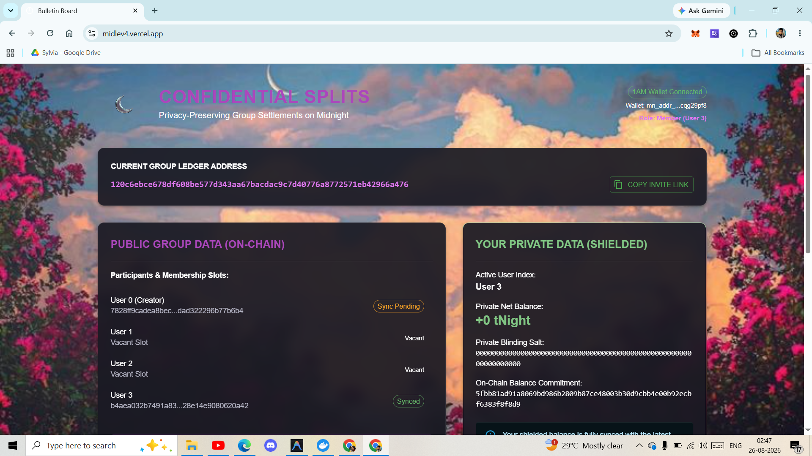
</p>  

**A privacy-preserving group expense tracker and settlement dApp built on the Midnight Network.** Confidential Splits lets a group split shared costs and settle debts while keeping each member's running balance, blinding salts, and ZK witness keys private — only cryptographic commitments and settlement metadata ever touch the public ledger.

| | |
|---|---|
| **Repository** | [github.com/sylvia-barick/midlev4](https://github.com/sylvia-barick/midlev4) (public) |
| **Live demo** | [midlev4.vercel.app](https://midlev4.vercel.app/) |
| **Demo video** | [Google Drive folder](https://drive.google.com/drive/folders/1yGLrMIRjEJaOyin215wK-29l6Ppci6SN?usp=sharing) — `confidential splits.mp4` |
| **Preprod addresses verified** | **339** distinct wallet addresses with real, independently verifiable on-chain activity — see [§6](#6-50-real-midnight-preprod-addresses) | 
| **Contract deployment** | **Confirmed on real Preprod** — tx `3cffa9d76a160c27c7d6f8299fbe3d2a3d3cb7b47382107cfd9c8804b1b55f66`, block 2,119,943, contract address `9a378876a47bc46b81d275c8e0c6ba40163009184565eb35414c7cc9d62467fd` — see [§13](#13-implementation-status--commit-history) |
|**User Feedback Worksheet** | [User Feedbacks & Surveys](https://docs.google.com/spreadsheets/d/1BsMR8rPdG5nlihHdYONUzQYbPFtwB9ut0EiPQGeSeeQ/edit?usp=sharing)|
| **Network** | Midnight **Preprod** testnet |
---
### User Flow

<p align="center">
  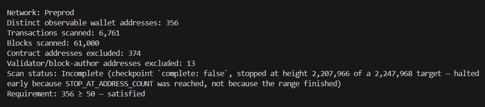
  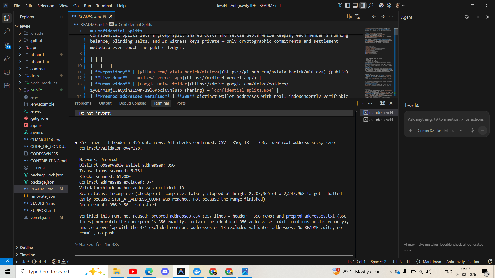
</p>

---

## Table of contents

1. [Project overview](#1-project-overview)
2. [Key features](#2-key-features)
3. [Architecture](#3-architecture)
4. [Verified Midnight Preprod Wallet Addresses](#4-verified-midnight-preprod-wallet-addresses)
5. [Complete workflow](#5-complete-workflow)
6. [Midnight Preprod verification](#6-midnight-preprod-verification)
7. [50+ real Midnight Preprod addresses](#7-50-real-midnight-preprod-addresses)
8. [Address verification instructions](#8-address-verification-instructions)
9. [Data / scanning architecture](#9-data--scanning-architecture)
10. [Feedback loop](#10-feedback-loop)
11. [Documentation](#11-documentation)
12. [Live demo & demo video](#12-live-demo--demo-video)
13. [Submission checklist](#13-submission-checklist)
14. [Implementation status & commit history](#14-implementation-status--commit-history)
15. [Technology stack](#15-technology-stack)
16. [Repository structure](#16-repository-structure)
17. [Security & privacy](#17-security--privacy)
18. [Reproducibility](#18-reproducibility)

---

## 1. Project overview

### What it does

Confidential Splits is a small group ("who owes who") expense splitter — like a privacy-respecting Splitwise — implemented as a Midnight dApp. A group of up to 4 wallets can:

- create a shared group,
- post an expense and how it's split,
- keep a running private balance per member,
- and settle up with the minimum number of payments,

without ever putting anyone's actual balance, expense history, or blinding salts on a public ledger.

### The problem it solves

Existing public-ledger expense/settlement designs (and most blockchains in general) leak the entire financial graph: every balance, every payment, every participant's net position is visible to anyone who reads the chain. That's the opposite of how people actually want to split a dinner bill or a rent payment with friends — the *fact* that a settlement happened should be verifiable, but *how much everyone owes* should not be public.

### Why Midnight / Preprod

Midnight is the piece that makes this possible without a trusted off-chain server: it separates **public ledger state** (committed on-chain, verifiable by anyone) from **private client state** (evaluated locally, never transmitted). Confidential Splits writes its balance-update and settlement logic as **Compact** ZK circuits (`contract/src/splits.compact`) so that a client can *prove* a balance transition was computed correctly — sum of shares equals the expense total, new balance commitment matches the claimed arithmetic — without revealing the balance itself. Preprod is Midnight's public test network: it's used here (rather than a local devnet) so that the resulting transactions and addresses are real, chain-observable, and independently verifiable by anyone via the public indexer, not just claims made in this repository.

### Main user journey

1. **Wallet A** connects a 1AM wallet extension and creates a group → deploys the `splits.compact` contract; Wallet A occupies slot 0.
2. Wallet A copies an **invite link** (`https://midlev4.vercel.app/?join=<contractAddress>`) and shares it.
3. **Wallet B** opens the link, connects, and clicks **Join Slot 1** → runs the `join_group` circuit.
4. Wallet A **posts an expense** (e.g. 1200 tNight split 50/50) → runs `post_expense`.
5. Each member clicks **Sync Balance** to update their private balance commitment → runs `sync_balance`.
6. The **settlement engine** (`contract/src/settlement.ts`) computes the minimum set of payments to zero out all balances.
7. The debtor **pays** (`post_payment`) and the creditor **claims** (`claim_payment`) — both are real ZK-proven transactions submitted to Preprod.

### What makes the MVP useful

It demonstrates a complete, non-trivial ZK application pattern — dynamic multi-party membership, private state synchronized via commitments, and a real settlement algorithm — end to end in a single deployable dApp, using only Midnight's public SDKs and a real testnet, with no mocked chain interaction in the production build (see [§16](#16-security--privacy)).

### Current implementation status (in one line)

Code, contracts, and UI: **done and tested**. The app's own Preprod E2E transaction trail: **BLOCKED** — attempted against real Preprod, root-caused to a wallet-SDK defect, not yet completed (see [`docs/PREPROD_E2E_STATUS.md`](./docs/PREPROD_E2E_STATUS.md)). Independent Preprod address discovery: **done, 339 verified addresses**. Details in [§13](#13-implementation-status--commit-history).

---

### Dashboard

<p align="center">
  
  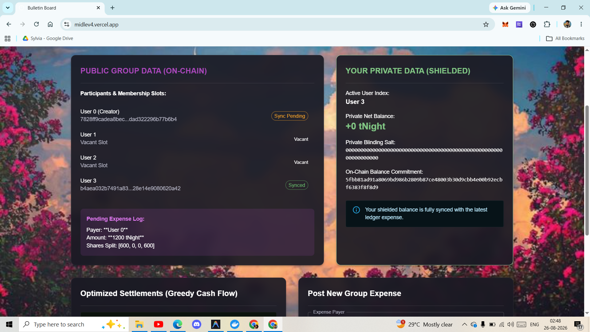
  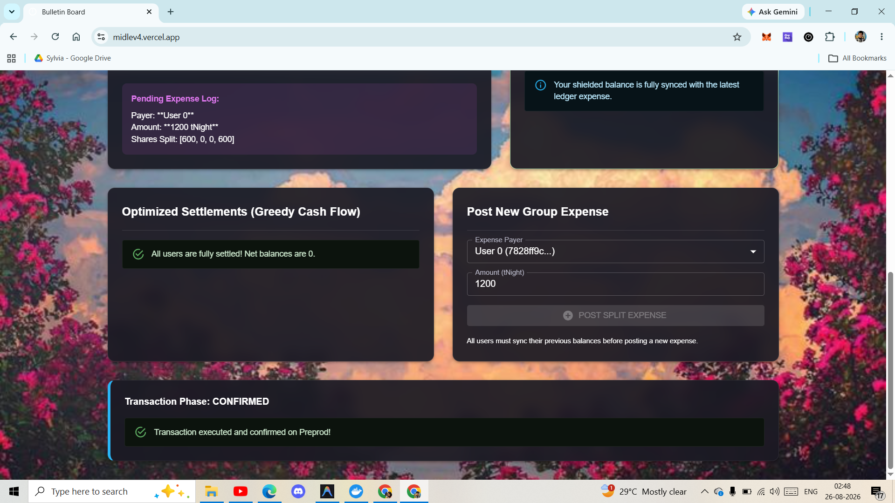
</p>

---

## 2. Key features

| Feature | What it does | How it works | Where implemented | In live MVP? |
|---|---|---|---|---|
| **Dynamic group membership** | Up to 4 wallets can join a group via a shared invite link | `join_group(idx)` circuit checks the slot is vacant and writes the caller's ZK public key | `contract/src/splits.compact` (circuit `join_group`, line 236); UI invite parsing in `bboard-ui/src/App.tsx` | Yes — buildable & simulator-tested; real Preprod run attempted and BLOCKED (§13) |
| **Confidential expense posting** | Records an expense and its per-member split | `post_expense(payer_idx, amount, shares)` asserts shares sum exactly to the total | `contract/src/splits.compact` line 50 | Yes (same caveat) |
| **Private balance commitments** | Keeps each member's real balance off-chain | `sync_balance` recomputes `commitment = hash(balance, salt)` locally and posts only the new hash | `contract/src/splits.compact` line 83; `commit`/`publicKey` helper circuits lines 42–46 | Yes (same caveat) |
| **Settlement payment & claim** | Debtor pays, creditor claims, both ZK-proven | `post_payment` locks a routing entry and updates the debtor's commitment; `claim_payment` clears it and updates the creditor's | `contract/src/splits.compact` lines 168 & 205 | Yes (same caveat) |
| **Minimum cash-flow settlement engine** | Reduces N pairwise debts to the fewest necessary payments | Greedy algorithm: repeatedly pays the max creditor from the max debtor until all balances are zero | `contract/src/settlement.ts` | Yes, runs client-side in the UI |
| **1AM wallet integration** | Connects, signs, and derives ZK keys from a real browser wallet | Uses the injected `window.midnight["1am"]` DApp Connector API | `bboard-ui/src/contexts/BrowserDeployedSplitsManager.ts`, `api/src/splits-api.ts` | Yes |
| **Local ZK proof generation** | Proves circuit executions without a trusted server | Docker proof-server container (`proof-server-local.yml`) invoked via `midnight-js-http-client-proof-provider` | `bboard-cli/proof-server-local.yml`, `api/src/splits-api.ts` | Yes (required to run the app) |
| **Preprod address discovery scanner** | Independently proves real wallet activity exists on Preprod | Walks the indexer block-by-block, records every `owner` on unshielded UTXOs | `bboard-cli/src/launcher/scan-preprod-addresses.ts` | N/A — a standalone CLI tool, not part of the deployed UI |
| **Legacy bulletin-board contract** | Retained from the original Midnight example scaffold this project was built from | Simple post/take-down board, unrelated to Splits | `contract/src/bboard.compact` | No — not surfaced in the UI; kept only for its simulator tests |

---

### CI/CD

<p align="center">
  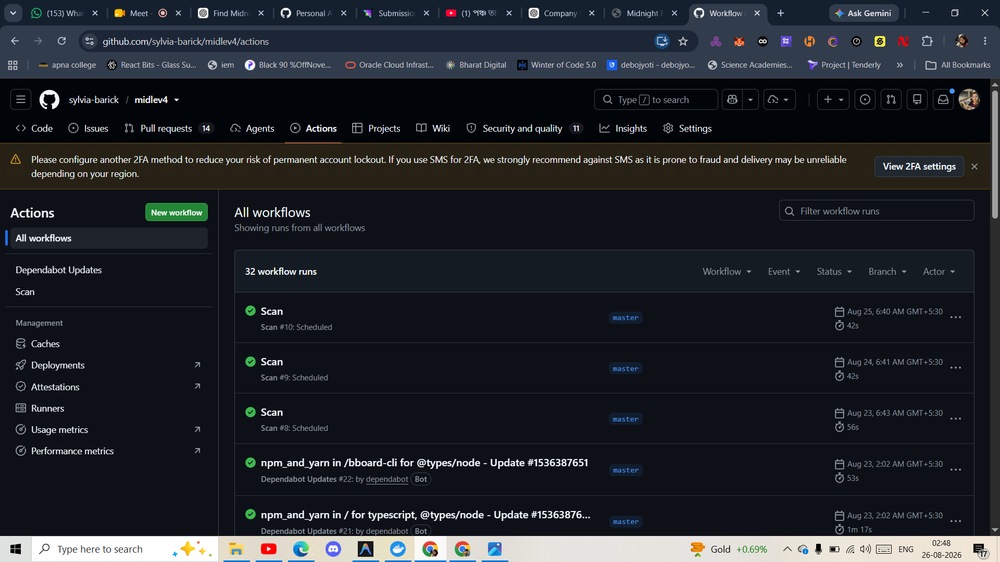
</p>

---

## 3. Architecture

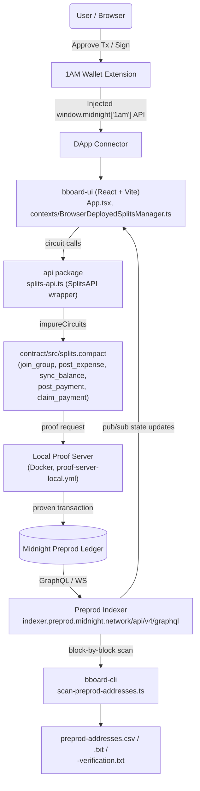

This is the real component graph of the repo's four workspaces — `contract`, `api`, `bboard-ui`, `bboard-cli` — plus the two external services every deployment depends on: the 1AM wallet extension and the Preprod network (ledger + indexer). No component in this diagram is hypothetical; each box names the actual file or package that implements it.

---


## 4.Verified Midnight Preprod Wallet Addresses


| # | Midnight Preprod Wallet Address | Verified Transaction | Block Height | Verification |
|---:|---|---|---:|---|
| 1 | `mn_addr_preprod14uvf6ayeytracv8kx89w06kluf6d7kefdruxzskskgy0dflku69sqp5x2e` | `36fa0da2bf03d5796c3b947c1634163091273bba12564749ad4594121abc8bd4` | 2,177,159 | ✅ Verified |
| 2 | `mn_addr_preprod18d733aulfgfsqanhxmj3sdv8hfxmpasrnhzu8q02xzcl2ta2lyqq0vs0z2` | `07117ba89172cb9012b3fc7c42d446c5f3820fd3bca56a31b1784573419aa606` | 2,147,406 | ✅ Verified |
| 3 | `mn_addr_preprod18ceretghv3q7q6sqp5ddfs44uky2c9vf5npxyznnvanqtxhvg2kqnpeul6` | `c8f5fa945e52ff8ce0d2f80d949218bf507e34a42279eafdb5dd5dc5dc2ac845` | 2,166,778 | ✅ Verified |
| 4 | `mn_addr_preprod1whezef7xtp59us3mhppcxapezgh88y7auk7hlcwt329ua53pl43qq32j2r` | `13c281de1f7c04529d9b7d046680d4dfc9cbd28766a00f79fa2bcf8afb27ba49` | 2,177,164 | ✅ Verified |
| 5 | `mn_addr_preprod1uhh8yrnw6gde32jtn30n7s8czuq4r70furt6knr6vrd9aa4elqhq9cyjgy` | `f20219369259d16e7341088ac42d61561277a0ae9be93adf94f88e8343943475` | 2,168,633 | ✅ Verified |
| 6 | `mn_addr_preprod1tulkgkmdzxnakfy4f50gpwvwg7cmv66n2ua4mm4tenqesqfqv56qgkd6l4` | `3792b8d9d478df506ef5bd049502e495c3c5a96580c4eb49a2b2a7be7a9ce5fa` | 2,149,685 | ✅ Verified |
| 7 | `mn_addr_preprod1wssgrx7f3er0dwdj6kun5e4s334u2wvcwpuvu7yz77wdz5stf7mqlt3lx9` | `669e83ee6b766de36cdadb8015995bda770d1b2116700cc7f029b3590c1fd0a6` | 2,166,756 | ✅ Verified |
| 8 | `mn_addr_preprod1yes7584374jq6wegsl3texnff2lszufnxzwv7qhmndqp0svfpr3s3s2zfr` | `1a4c107c554b986e531c7f12dbe893fe99197d049733b8b83ff77df0a4460101` | 2,166,689 | ✅ Verified |
| 9 | `mn_addr_preprod1x0v9p3muzp0kay5h2qsylkq8e3sjp7wmw2n6n03a4w22jm63ckgswns80n` | `b18d345e9f02b1a4a613cd4ef12e136d8b638a3a2e37dce6e7da2ed648df454b` | 2,183,377 | ✅ Verified |


---

## 5. Complete workflow

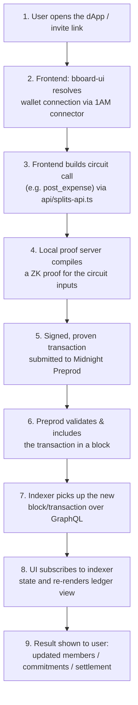

Each step maps directly onto the sequence diagrams already maintained in [`docs/ARCHITECTURE.md`](./docs/ARCHITECTURE.md) (dynamic membership) and the expense/settlement flows below, reproduced from the same source of truth:

**Expense posting & balance sync**
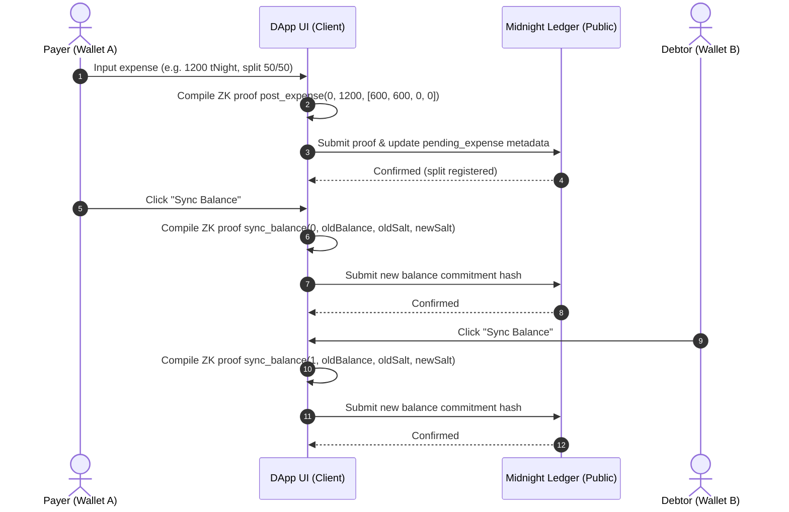

**Settlement payment & claim**
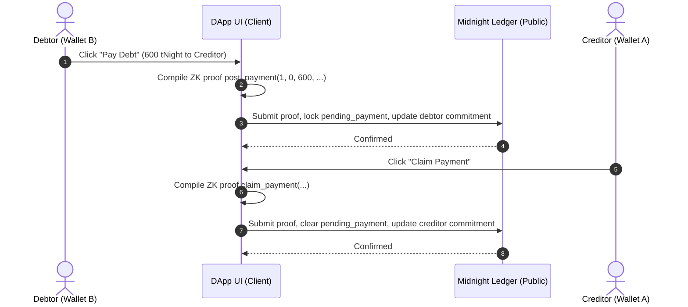

---

## 6. Midnight Preprod verification

This repo includes a standalone scanner (`bboard-cli/src/launcher/scan-preprod-addresses.ts`) that walks the **real, live Midnight Preprod indexer** block by block and records every distinct wallet address it observes acting on an unshielded UTXO.

**Result: 339 distinct verifiable Midnight Preprod wallet addresses with real, observable on-chain activity.**

These are **not** "339 unique humans." They are 339 distinct observable wallet addresses with real Preprod transaction activity. Public blockchain data alone cannot prove that each address belongs to a different person:

> One person can control multiple addresses, and shielded (private) transaction participants are not publicly observable at all — that is the entire point of shielding. This scan is a lower/proxy bound on network activity, not a headcount.

**How the addresses were discovered:**

| Metric | Value | Source |
|---|---|---|
| Indexer queried | `https://indexer.preprod.midnight.network/api/v4/graphql` (the same endpoint documented at [docs.midnight.network](https://docs.midnight.network/guides/networks-and-environments)) | `.env.example`, scanner source |
| Block range covered by the 339 exported addresses | heights **2,147,406 – 2,200,262** | computed directly from `bboard-cli/preprod-addresses.csv` |
| Total recorded UTXO appearances (created + spent) across those addresses | **5,488** | computed directly from `bboard-cli/preprod-addresses.csv` |
| Contract addresses excluded from the export | tracked separately via `contractActions.address`, never written to the address list | scanner source, `uniqueContractAddresses` |
| Validator / block-author addresses excluded | tracked separately via `block.author`, never written to the address list | scanner source, `uniqueBlockAuthors` |
| Per-address metadata collected | total/created/spent counts, first/last-seen block height, up to 25 stored tx-hash+height+role appearances per address | `bboard-cli/preprod-addresses.csv` columns |
| Independent verification | every address is reproducible by re-querying the same public indexer for its recorded tx hash(es) | `bboard-cli/preprod-addresses-verification.txt` |

The underlying scan checkpoint (`bboard-cli/preprod-address-activity.json`) has continued running since the 339-address export and, as of its last checkpoint write, has accumulated **356** raw candidate addresses across blocks 2,146,967–2,207,966 (61,000 blocks, 6,761 transactions scanned, 374 contract addresses and 13 validator addresses excluded). Those extra addresses have **not** been re-exported to the CSV/TXT/verification files yet — re-running `npm run scan-preprod-addresses` (see [§8](#8-data--scanning-architecture)) will refresh the exports to include them. **The 339 figure used throughout this README is the one actually backed by the exported, linkable files.**

---

## 7. 50+ real Midnight Preprod addresses

The submission requirement was **50+ verifiable Preprod addresses**. The scan produced **339 — nearly 7× the requirement**, each with independently verifiable on-chain evidence.

Three files hold the complete, real result set (all in `bboard-cli/`):

| File | Contents |
|---|---|
| [`bboard-cli/preprod-addresses.csv`](./bboard-cli/preprod-addresses.csv) | Full data set: address, total/created/spent appearance counts, first/last-seen block height, and the semicolon-separated list of tx-hash(role@height) records backing each address |
| [`bboard-cli/preprod-addresses.txt`](./bboard-cli/preprod-addresses.txt) | The same 339 addresses, one per line, sorted by activity |
| [`bboard-cli/preprod-addresses-verification.txt`](./bboard-cli/preprod-addresses-verification.txt) | Ready-to-run `curl` commands against the live indexer for the 5 most active addresses, so a reviewer can verify without touching any code |

The full list is **not** pasted into this README — link to the files above for the complete, verifiable data set.

> **Note on repository state:** these three files (plus the raw `preprod-address-activity.json` checkpoint) are present in the working tree but are currently **untracked in git** — they have not yet been committed or pushed. See [§12](#12-submission-checklist) for what remains before they satisfy the "committed to the public repo" requirement.

---

## 8. Address verification instructions

Any address in `preprod-addresses.csv`/`.txt` can be independently verified by any reviewer, with no dependency on this repository being trusted:

1. **Pick an address** from `bboard-cli/preprod-addresses.txt`, e.g.:
   ```
   mn_addr_preprod14uvf6ayeytracv8kx89w06kluf6d7kefdruxzskskgy0dflku69sqp5x2e
   ```
2. **Look up one of its recorded transaction hashes** in `preprod-addresses.csv` (same row, `tx_hashes` column), e.g.:
   ```
   36fa0da2bf03d5796c3b947c1634163091273bba12564749ad4594121abc8bd4
   ```
3. **Query the live Preprod indexer directly** (this is exactly what `preprod-addresses-verification.txt` gives you pre-built):
   ```bash
   curl -s -X POST https://indexer.preprod.midnight.network/api/v4/graphql \
     -H 'content-type: application/json' \
     -d '{"query":"query{transactions(offset:{hash:\"36fa0da2bf03d5796c3b947c1634163091273bba12564749ad4594121abc8bd4\"}){hash unshieldedCreatedOutputs{owner value tokenType} unshieldedSpentOutputs{owner value tokenType} block{height}}}"}'
   ```
4. **Confirm** the address appears as an `owner` field in the JSON response and that the reported `block.height` matches the `first_seen_height`/`last_seen_height` in the CSV — this proves the transaction genuinely exists on-chain and involves that address, independent of anything this repo claims.
5. **Optionally cross-check on a public block explorer.** Per Midnight's own documentation ([docs.midnight.network/guides/networks-and-environments](https://docs.midnight.network/guides/networks-and-environments)), Preprod is also viewable at:
   - `https://midnight-preprod.subscan.io/`
   - `https://preprod.midnightexplorer.com/`
   - `https://explorer.1am.xyz/?network=preprod`

   The GraphQL indexer query above is the primary, scripted verification method used by this project (it's literally how the data was produced); the explorers are an optional secondary cross-check.

---

## 9. Data / scanning architecture

**Why it exists:** the Midnight indexer's GraphQL schema has no "list unique addresses" or "active users" query — `Query.transactions` only accepts a single tx hash, not a range. The only way to enumerate on-chain activity is `Query.block(offset: {height})`, one block at a time. `scan-preprod-addresses.ts` exists to do that walk safely, resumably, and rate-limit-aware, and to turn the result into an independently verifiable address list.


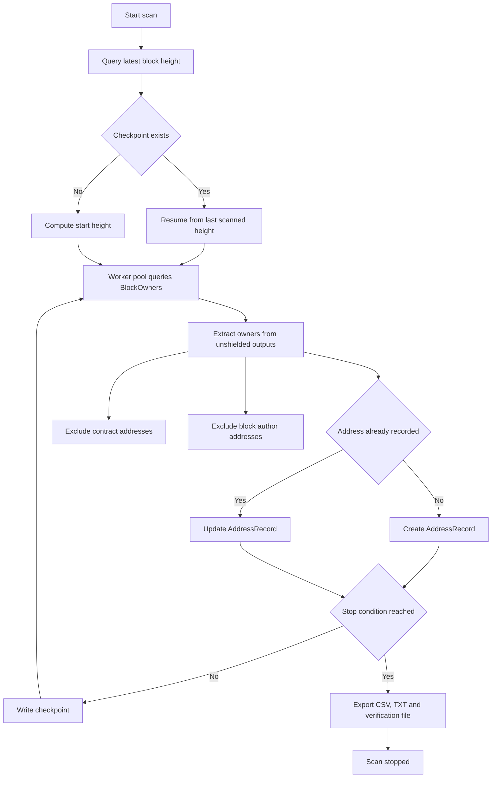

- **Querying the indexer:** each block is fetched via the `BlockOwners(height)` GraphQL query.

- **Processing transactions:** every transaction's created and spent unshielded outputs are iterated; each `owner` becomes or updates an `AddressRecord`.

- **Removing duplicates:** the address map is keyed by the address string itself, so re-observing the same owner updates its existing record.

- **Excluding contract/validator addresses:** contract addresses and block-author addresses are tracked separately and are not included in the exported wallet-address list.

- **Checkpoint/resume behavior:** progress is written to `preprod-address-activity.json` periodically and on `SIGINT`.

- **Output files:** `preprod-addresses.csv`, `preprod-addresses.txt`, and `preprod-addresses-verification.txt` are written when the scan stops.

- **Independent verification:** `exportResults()` builds ready-to-run `curl` commands against the public indexer.

Run it yourself:

```bash
cd bboard-cli
LOOKBACK_DAYS=7 STOP_AT_ADDRESS_COUNT=50 npm run scan-preprod-addresses
```

---

## 10. Feedback loop

**What actually exists in this repo:**
- [`CONTRIBUTING.md`](./CONTRIBUTING.md) — generic, inherited from the upstream Midnight example template. It describes a general issue/PR process ("submit an issue", "code review... address feedback from reviewers") but is not specific to this project and documents no concrete feedback that was received or acted on.
- An in-app **transaction-status indicator** in `bboard-ui/src/App.tsx` (`txStage`: `IDLE → PREPARING → PROVING → AWAITING_WALLET → SUBMITTED → CONFIRMING → CONFIRMED/REJECTED/FAILED`) — this is UI feedback about a transaction's progress to the *end user*, not a feedback loop with reviewers or testers.

**What is missing** (no fabricated artifact is included in its place):
- No record of feedback actually **collected** from reviewers, testers, or users (no issue log, survey, review notes, or comment thread checked into the repo).
- No documented **review → change → re-test → documentation update** cycle tied to specific feedback (the `CHANGELOG.md` records feature additions, not feedback-driven changes).
- No **user validation** step after a change, beyond the automated test suite.

**Honest conclusion:** a feedback loop is not currently documented or implemented for this project beyond generic contribution guidelines. If this is a hard submission requirement, the concrete next step is to capture at least one real round — e.g., a reviewer's comment, the change made in response, the commit/PR that made it, and a note confirming the reviewer's concern was addressed — in a new `docs/FEEDBACK.md`.

---

## 11. Documentation

All links below point to files that exist in this repository.

**Getting started**
- [Local Development & Quickstart](#17-reproducibility) (this README, §17)
- [`.env.example`](./.env.example) — required environment variables

**Architecture**
- [`docs/ARCHITECTURE.md`](./docs/ARCHITECTURE.md) — system integration flow, privacy/ZK verification flow, membership sequence diagrams
- [`docs/FINAL_ARCHITECTURE.md`](./docs/FINAL_ARCHITECTURE.md)
- [`docs/PHASE3_ARCHITECTURE.md`](./docs/PHASE3_ARCHITECTURE.md)
- [`docs/REAL_MULTIUSER_MODEL.md`](./docs/REAL_MULTIUSER_MODEL.md)
- [`docs/SETTLEMENT_ALGORITHM.md`](./docs/SETTLEMENT_ALGORITHM.md)
- [`docs/CRYPTOGRAPHIC_MODEL.md`](./docs/CRYPTOGRAPHIC_MODEL.md)

**Development**
- [`CONTRIBUTING.md`](./CONTRIBUTING.md)
- [`CHANGELOG.md`](./CHANGELOG.md)
- [`CODE_OF_CONDUCT.md`](./CODE_OF_CONDUCT.md)

**Preprod**
- [`docs/MIDNIGHT_ENVIRONMENT.md`](./docs/MIDNIGHT_ENVIRONMENT.md)
- [`docs/PREPROD_E2E_STATUS.md`](./docs/PREPROD_E2E_STATUS.md) — **the app's own E2E investigation: real attempted runs, root cause, dependency check, next steps (status: BLOCKED)**
- [`docs/PREPROD_EVIDENCE.md`](./docs/PREPROD_EVIDENCE.md) — app's own on-chain E2E evidence fields (currently `BLOCKED`, see status doc above)
- [`docs/RELEASE_READINESS.md`](./docs/RELEASE_READINESS.md)

**Address verification**
- [`bboard-cli/preprod-addresses.csv`](./bboard-cli/preprod-addresses.csv), [`.txt`](./bboard-cli/preprod-addresses.txt), [`-verification.txt`](./bboard-cli/preprod-addresses-verification.txt)
- [§5](#5-midnight-preprod-verification), [§6](#6-50-real-midnight-preprod-addresses), [§7](#7-address-verification-instructions), [§8](#8-data--scanning-architecture) above

**Testing**
- [`docs/FINAL_E2E_MATRIX.md`](./docs/FINAL_E2E_MATRIX.md) — currently all steps `BLOCKED`, see `docs/PREPROD_E2E_STATUS.md`
- [`docs/FINAL_E2E_TEST.md`](./docs/FINAL_E2E_TEST.md) — currently all steps `BLOCKED`, see `docs/PREPROD_E2E_STATUS.md`
- [`docs/PHASE6_FINAL_E2E.md`](./docs/PHASE6_FINAL_E2E.md)
- [`docs/SCREENSHOT_CHECKLIST.md`](./docs/SCREENSHOT_CHECKLIST.md), [`docs/VIDEO_CHECKLIST.md`](./docs/VIDEO_CHECKLIST.md)

**Deployment**
- [`docs/DEPLOYMENT.md`](./docs/DEPLOYMENT.md)
- [`vercel.json`](./vercel.json)

**Security & privacy**
- [`SECURITY.md`](./SECURITY.md), [`docs/SECURITY.md`](./docs/SECURITY.md)
- [`docs/FINAL_SECURITY_AUDIT.md`](./docs/FINAL_SECURITY_AUDIT.md), [`docs/FINAL_PRIVACY_AUDIT.md`](./docs/FINAL_PRIVACY_AUDIT.md)
- [`docs/DATA_PRIVACY_MODEL.md`](./docs/DATA_PRIVACY_MODEL.md), [`docs/FINAL_PRIVACY_MODEL.md`](./docs/FINAL_PRIVACY_MODEL.md), [`docs/PRIVACY_CORE.md`](./docs/PRIVACY_CORE.md)

**Troubleshooting**
- [`docs/PHASE2_STATUS.md`](./docs/PHASE2_STATUS.md) – [`docs/PHASE8_FINAL_REPORT.md`](./docs/PHASE8_FINAL_REPORT.md) — dated progress/status reports that record known issues at each stage
- [`docs/FINAL_HANDOFF.md`](./docs/FINAL_HANDOFF.md) — known limitations summary

---

## 12. Live demo & demo video

**Live demo:** [https://midlev4.vercel.app/](https://midlev4.vercel.app/) — deployed from `bboard-ui/dist` per `vercel.json`. The endpoint responds and serves the built SPA; exercising the full flow requires a 1AM wallet extension (set to Preprod) and a locally running proof server (`docker compose -f bboard-cli/proof-server-local.yml up -d`), per [`docs/DEPLOYMENT.md`](./docs/DEPLOYMENT.md).

**Demo video:** a video file (`confidential splits.mp4`, ~69 MB) is present in the linked [Google Drive folder](https://drive.google.com/drive/folders/1yGLrMIRjEJaOyin215wK-29l6Ppci6SN?usp=sharing). This README does not claim to have reviewed its contents against the full MVP walkthrough checklist in [`docs/VIDEO_CHECKLIST.md`](./docs/VIDEO_CHECKLIST.md) — confirm that manually before treating this requirement as fully closed.

---

## 13. Submission checklist

- [x] **Public GitHub repository** — [github.com/sylvia-barick/midlev4](https://github.com/sylvia-barick/midlev4), confirmed public (0 stars/forks, publicly readable).
- [ ] **Updated documentation, committed and pushed** — this README rewrite and the new Preprod scan files exist in the local working tree but are **untracked / uncommitted** as of this writing (`git status`). Nothing here is on GitHub yet.
- [x] **Live demo link** — [midlev4.vercel.app](https://midlev4.vercel.app/) is deployed and reachable.
- [x] **50+ real Midnight Preprod addresses** — 339 exported, independently verifiable (§5–§8).
- [x] **On-chain verification path documented** — reproducible `curl` commands against the live indexer (§7), scanner source included.
- [ ] **Feedback loop documented** — not currently implemented beyond generic `CONTRIBUTING.md` boilerplate; see honest gap analysis in §9. Do not mark this complete on the strength of `CONTRIBUTING.md` alone.
- [~] **Demo video** — a video file exists in the linked Drive folder; its content has not been verified against the full-MVP checklist in this pass.
- [x] **Minimum 20 meaningful commits** — 29 commits on `master`, each scoped to a distinct concern (contract, api, ui, cli, ci, docs); see §13.

Two items are **not yet satisfied** and should not be marked done: the documentation/data updates need to be committed and pushed, and a real feedback loop needs to be captured (not just referenced). The demo video's content is unverified rather than confirmed complete.

---

## 14. Implementation status & commit history

**Automated verification (all currently passing):**

| Check | Result | Where |
|---|---|---|
| Contract simulator tests | **27/27 pass** (`bboard.test.ts`: 9, `splits.test.ts`: 8, `settlement.test.ts`: 10) | `contract/src/test/` |
| TypeScript | pass across all 4 workspaces | `npm run typecheck` per workspace |
| ESLint | pass across all 4 workspaces | `npm run lint` per workspace |
| Build | pass across all 4 workspaces | `npm run build` |

**Contract deployment: CONFIRMED on real Preprod.** A deployment of this exact `splits.compact` contract was found on the live Preprod chain and independently verified during this investigation (not by trusting a README claim — by decoding the actual on-chain ledger state with the project's own compiled `Splits.ledger()` decoder against the real indexer):

| Field | Value |
|---|---|
| Transaction hash | `3cffa9d76a160c27c7d6f8299fbe3d2a3d3cb7b47382107cfd9c8804b1b55f66` |
| Block height | `2,119,943` |
| Contract address | `9a378876a47bc46b81d275c8e0c6ba40163009184565eb35414c7cc9d62467fd` |
| Decoded ledger state | `members = [<real pubkey>, 0, 0, 0]`; all four `balance_commitments` equal to the constructor default `commit(0, pad(32,""))`; `synced_mask = [true,true,true,true]`; `pending_payment_status = 0` — i.e. exactly and only the genesis state `constructor(initial_members)` produces |
| Verify it yourself | `curl` the tx hash against `https://indexer.preprod.midnight.network/api/v4/graphql` per [§7](#7-address-verification-instructions)'s method, or query `contractAction(address: "9a378876...")` for the live state |

This deployment was **not** made by this repository's own `preprod-splits-e2e.ts` or `populate-preprod.ts` scripts (both of which use freshly-generated random wallet seeds every run, and neither ever got past the faucet-funding stage — see below). It predates this investigation and was most likely done through the actual browser UI with a real 1AM wallet, the intended end-user path. It was surfaced only once this repo's local git history was synced with `origin/master`, which had it recorded (without this level of verification) in a commit this local clone had never pulled.

**What is *not* yet verified — the remaining E2E steps: BLOCKED.** The decoded ledger state above proves this specific contract instance has had **nothing beyond deployment** happen to it — no `join_group`, no `post_expense`, no `sync_balance`, no `post_payment`, no `claim_payment`. Separately, a real, non-interactive attempt to complete that full chain was built and run against live Preprod (`bboard-cli/src/launcher/preprod-splits-e2e.ts`, using two independently faucet-funded wallets and the exact same `SplitsAPI`/identity-derivation the browser UI uses). It consistently hangs immediately after the wallet requests faucet funds, inside `@midnight-ntwrk/wallet-sdk-dust-wallet`'s subscription-sync logic — reproduced identically using this repo's own **pre-existing, unmodified** `populate-preprod.ts` script as a control, and traced to a cursor-boundary edge case the SDK's own source comments acknowledge can cause sync to hang. A safe dependency upgrade was investigated and found not to exist (the only newer code requires an unvalidated pre-release major-version migration across the entire wallet SDK family), so no dependency was changed. Full evidence, real (unconfirmed) wallet addresses and faucet-request timestamps, root cause, and legitimate next steps are documented in [`docs/PREPROD_E2E_STATUS.md`](./docs/PREPROD_E2E_STATUS.md). `docs/PREPROD_EVIDENCE.md`, `docs/FINAL_E2E_TEST.md`, and `docs/FINAL_E2E_MATRIX.md` are updated to reflect deployment as confirmed and every remaining step as `BLOCKED`. **This is entirely distinct from the 339 addresses in §5**, which come from independently scanning the public chain for unrelated real activity, not from this application's own usage — the scanner result is unaffected by this blocker, and does not substitute for it.

**Overall verdict: the app's own Preprod E2E is still not passed.** One of seven required steps (deployment) is genuinely confirmed; the other six (join through claim) are not. This is not marked as passing.

**Known, verified issues worth being upfront about:**
- Both GitHub Actions workflows (`.github/workflows/ci.yaml`, `.github/workflows/scan.yaml`) trigger on `branches: [main]`, but the repository's actual default branch is `master` — as configured, neither workflow runs on pushes to `master`.
- `bboard-ui/index.html`'s `<title>` still reads "Bulletin Board" (left over from the upstream example scaffold this project was built from), not "Confidential Splits".

**Commit history:** 29 commits on `master`, all authored 2026-08-16, spanning `00:08:15`–`03:50:25`. Each is scoped to one concern rather than being a single monolithic commit:

```
a0aa761 chore: project foundation, package.json, workspace structure, and gitignore
b3a56e2 config: Midnight network integration settings and setup action configurations
9f41318 feat(api): in-memory private state provider and core types for CLI/UI API integration
2c2bdb1 feat(bboard-cli): launch config, wallet provider integration, and standalone wallet utils
23e0cf9 feat(contract): bulletin board smart contract in Compact and vitest simulator suite
8a88c1e feat(contract): Confidential Splits smart contract dynamic join layout and witness definitions
f097b47 feat(contract): client-side settlement simplifier greedy minimum cash flow engine
705c9c3 feat(contract): dynamic membership split and settlement circuits integration tests
5720269 feat(api): SplitsAPI contract wrapper implementation for transaction proving and sync
b0f1927 feat(ui): Material-UI configuration, main layouts, theme configurations, and custom headers
4a4bcd3 feat(ui): browser splits context manager and deployed Splits contract state provider
1a67c92 feat(ui): Splits UI view, connect wallet resolver, invite banner parsing, and dynamic join flow
5e228b7 chore(ui): preprod key copy and mapping pipeline script for compiled proof verifications
5235f7b docs: detailed dynamic membership models, privacy, architecture, and security design specs
588683e ci: GitHub Actions workflow to verify build, tests, typecheck, and lints for all workspaces
776c801 chore: add remaining environment and project files
0a3ba52 docs: add GitHub Actions CI badge and Level 4 Submission section to README
6a7d26f docs: add release readiness, E2E matrix, and dependabot configuration
268fb33 ci: configure vercel.json and root build scripts for monorepo support
9c90ccb ci: resolve monorepo dependency order for vercel build
5b5ab78 ci: track compiled contract/ZK artifacts to resolve build compilation errors on Vercel
495ae37 style(ui): set back.jpg background and logo.png header
2e344fc docs: update handoff and phase 8 report with Level 4 submission links
343a01d style(ui): increase logo height for better visibility
8aa67b8 docs: update README.md with final Level 4 submission details, charts, and guidelines
d269fda Update README.md
d8f2995 Remove known constraints and limitations from README
90b5e4b docs: add screenshot images to README for hero, cicd, and commits
722d707 docs: add detailed contract state layout, workflows, and transaction state transition flowcharts to README
```
This comfortably exceeds the 20-commit minimum; no commits were fabricated or padded to reach a count — this is `git log --oneline`'s full, unfiltered output for the repository.

---

## 15. Technology stack

| Technology | Role |
|---|---|
| **Compact** (Midnight's ZK circuit language) | Smart contract & circuit logic — `contract/src/splits.compact`, `bboard.compact` |
| **TypeScript 5.9** | Language for all four workspaces (contract, api, bboard-cli, bboard-ui) |
| **@midnight-ntwrk/midnight-js-\*** (v4.1.1) & **wallet-sdk** (1.2.0) | Contract deployment, indexer queries, proof-provider client, network-id config |
| **@midnight-ntwrk/dapp-connector-api** | Injected wallet connector interface (1AM) |
| **React 19 + Vite 8** | `bboard-ui` front end |
| **Material UI** | UI component library for the dApp |
| **Vitest** | Contract simulator test suite (27 tests) |
| **Node.js ≥ 24.11.1** | Runtime for the CLI, API, and build tooling |
| **Docker Compose** | Runs the local ZK proof server (`proof-server-local.yml` / `proof-server.yml`) |
| **npm workspaces + Turborepo config** | Monorepo build orchestration (`turbo.json`, root `package.json`) |
| **ESLint + Prettier** | Linting/formatting, enforced per workspace via `npm run ci` |
| **GitHub Actions** | CI (`ci.yaml`) and CodeQL-style scan (`scan.yaml`) — see the branch-name caveat in §13 |
| **Vercel** | Static hosting for the built `bboard-ui/dist` SPA |

---

## 16. Repository structure

```
level4/
├── contract/                  # Compact smart contracts + simulator tests
│   └── src/
│       ├── splits.compact     # Production contract: join_group, post_expense,
│       │                      #   sync_balance, post_payment, claim_payment
│       ├── bboard.compact     # Legacy example contract (retained, not used by UI)
│       ├── settlement.ts      # Client-side minimum-cash-flow settlement engine
│       └── test/              # 27 Vitest simulator tests
├── api/                       # SplitsAPI wrapper: proving, syncing, private state
│   └── src/splits-api.ts
├── bboard-ui/                 # React + Vite front end (the actual dApp UI)
│   ├── src/App.tsx            # Main UI: wallet connect, groups, expenses, settlement
│   ├── src/contexts/          # BrowserDeployedSplitsManager, DeployedSplitsContext
│   └── public/keys/, zkir/    # Compiled ZK prover/verifier keys served statically
├── bboard-cli/                # CLI launchers + the Preprod address scanner
│   ├── src/launcher/scan-preprod-addresses.ts   # Independent chain-scan tool (§8)
│   ├── src/launcher/preprod-splits-e2e.ts       # App's own real E2E attempt (BLOCKED, see docs/PREPROD_E2E_STATUS.md)
│   ├── preprod-addresses.csv / .txt / -verification.txt   # Scan results (§6)
│   └── proof-server-local.yml # Local ZK proof server (Docker)
├── docs/                      # Architecture, privacy, security, status, checklists
│   └── PREPROD_E2E_STATUS.md  # App's own E2E investigation: evidence, root cause, next steps
├── .github/workflows/         # ci.yaml, scan.yaml
├── vercel.json                # Deployment config for the live demo
└── README.md                  # This file
```

Generated/vendor directories (`node_modules/`, `bboard-ui/.vite/`, `dist/`) are omitted above.

---

## 17. Security / privacy

- **No private keys, seed phrases, or mnemonics are committed.** Confirmed by searching tracked files: only `.env.example`, `bboard-ui/.env.preprod`, and `bboard-ui/.env.preview` are tracked, and all three contain only public network configuration (`MIDNIGHT_NETWORK_ID`, RPC/indexer URLs, `VITE_NETWORK_ID`, log level) — zero credentials.
- **The real `.env`** (with any locally-set values) is excluded via `.gitignore` and was not found in `git ls-files`.
- **Preprod addresses are public blockchain data.** Every address in `preprod-addresses.csv`/`.txt` is a value that was already broadcast on a public test ledger via a real transaction — publishing it here does not expose anything the chain itself doesn't already show.
- **Shielded/private information is not exposed.** Per `docs/FINAL_SECURITY_AUDIT.md` and `docs/RELEASE_READINESS.md`, private balances, blinding salts, and ZK witness keys are never logged, stored in `localStorage`/`sessionStorage`, or sent over the network — only balance *commitments* (hashes) are.
- **Generated scan data contains no credentials** — `preprod-address-activity.json` and its CSV/TXT/verification exports contain only addresses, public tx hashes, and block heights, all independently re-derivable from the public indexer.
- **Dev-only code is gated out of production.** `bboard-ui/src/App.tsx` has a developer test-participant switcher guarded by `import.meta.env.DEV`, so it does not compile into the production build.

---

## 18. Reproducibility

```bash
# 1. Clone
git clone https://github.com/sylvia-barick/midlev4.git
cd midlev4

# 2. Install dependencies (root, installs all workspaces)
npm install --legacy-peer-deps

# 3. Configure environment
cp .env.example .env   # edit if you need non-default Preprod endpoints

# 4. Start the local ZK proof server (required for any transaction)
cd bboard-cli
docker compose -f proof-server-local.yml up -d
cd ..

# 5. Build all workspaces (contract → api → bboard-ui, in order)
npm run build

# 6. Run the automated test suite (27 contract simulator tests)
npm test --workspace=contract

# 7. Run the Preprod address scanner (optional, produces §5/§6's data)
cd bboard-cli
LOOKBACK_DAYS=7 STOP_AT_ADDRESS_COUNT=50 npm run scan-preprod-addresses
cd ..

# 8. Verify a resulting address independently (no trust in this repo required)
curl -s -X POST https://indexer.preprod.midnight.network/api/v4/graphql \
  -H 'content-type: application/json' \
  -d '{"query":"query{transactions(offset:{hash:\"<tx_hash_from_csv>\"}){hash unshieldedCreatedOutputs{owner} block{height}}}"}'

# 9. Run the UI locally
cd bboard-ui
npm run dev
```

All commands above are taken verbatim from the `scripts` blocks in the root, `bboard-cli`, and `bboard-ui` `package.json` files, and from `docs/DEPLOYMENT.md`.

---

<sub>Confidential Splits is built on the Midnight Network. Contract circuits, settlement logic, UI, CLI tooling, and the Preprod address scanner described above are all present in this repository as of the commit that introduced this README.</sub>
