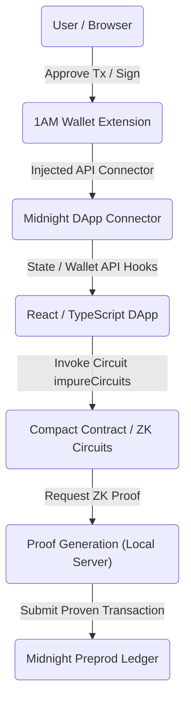
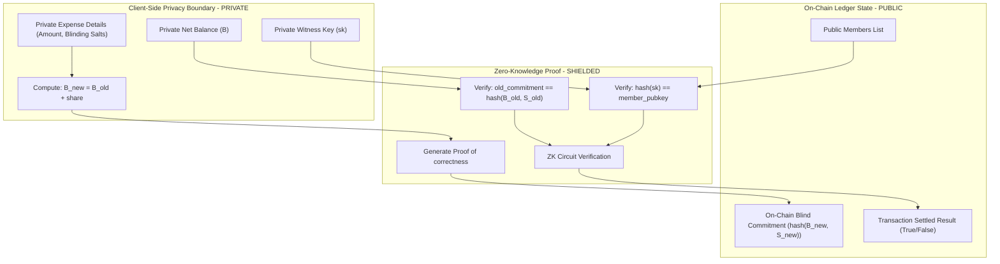
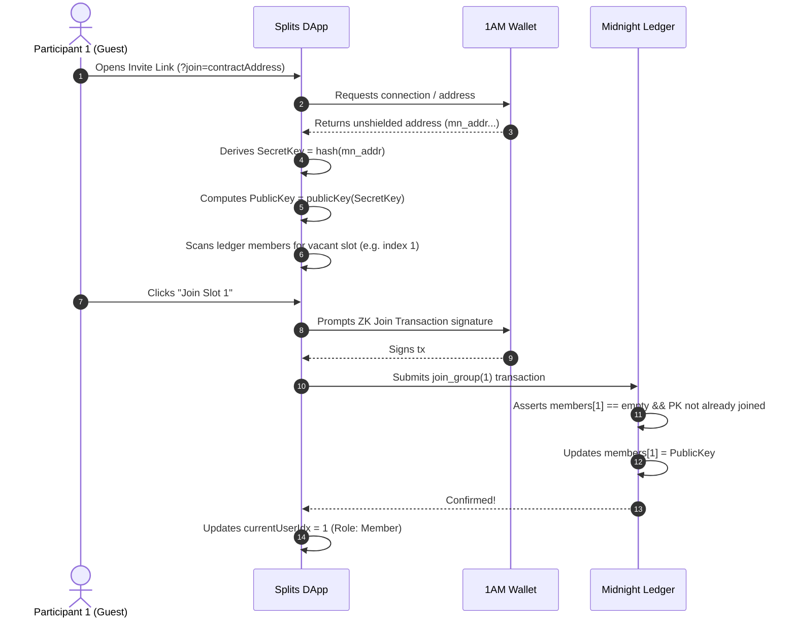

# Confidential Splits Architecture

This document describes the structural topology and cryptographic data flows of the **Confidential Splits** dApp.

---

## 1. System Integration Flow

---

## 2. Data Privacy & Zero-Knowledge Verification Flow

---

## 3. Dynamic Group Membership Flow

